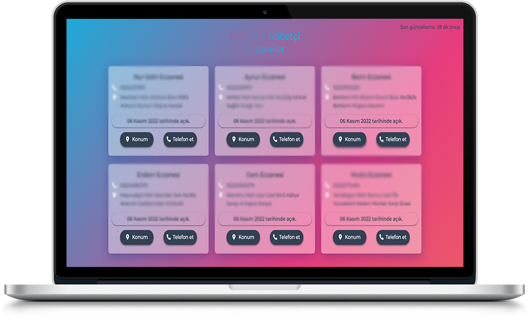
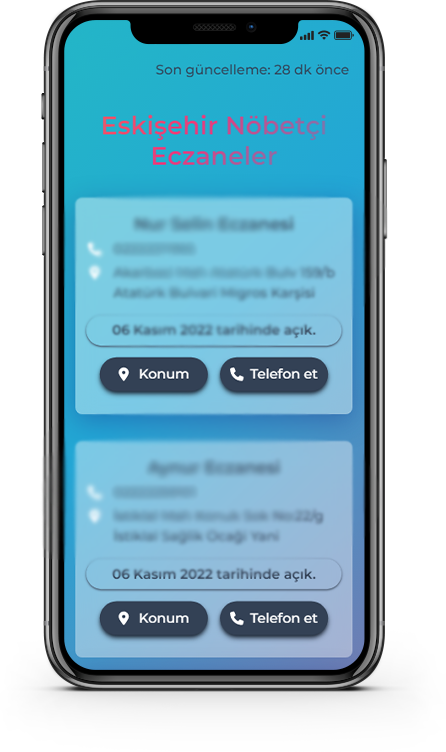

# Eskisehir Nobetci Eczaneler

<pre>Heroku ücretsiz deployları kaldırdığı için backend şu anda çalışmıyor.</pre>

### **https://eskisehirnobetcieczane.netlify.app/**

 

<pre>
    NOT: Bu bir API servisi değildir. Yalnızca hazırladığım websiteyi sunuyorum. 
</pre>

- **Proje gerçek ve günlük olarak güncellenen verilerden oluşuyor.** 

- Verileri Puppeteer ile **scrapelediğim** ve backend'ime ücretsiz bir hosting servisi üzerinden eriştiğim için API yanıtları uzun sürebilir.   **(Yükleme ekranında 10-15sn+ bekleyebilirsiniz.)**

- Ticari ya da maddi kâr sağlama amacım yok. Yalnızca yeni teknolojiler deneyimleyip çevreme faydalı olmak istiyorum. Verileri **scrapelediğim** sitede verilerin kullanılamayacağına dair bir ifadeye rastlamadım. Dolayısıyla projenin Github'da barınması sakıncalı mı bilmiyorum.
  

- **Proje varlığı bir sorun teşkil ediyorsa Github profilimde bana ulaşabileceğiniz linkler bulunuyor. Lütfen ulaşın. En kısa sürede gerekeni yaparım.**

 

|           Desktop View            |           Mobile View            |
| :-------------------------------: | :------------------------------: |
|  |  |
